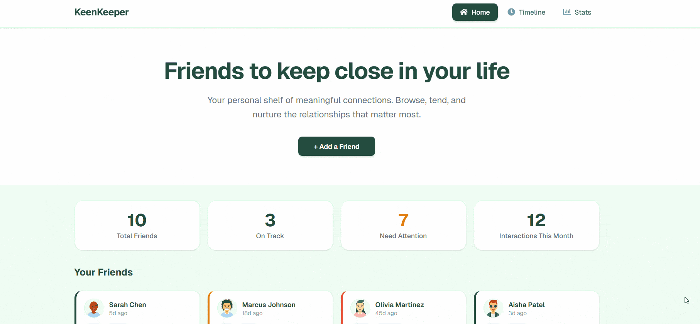
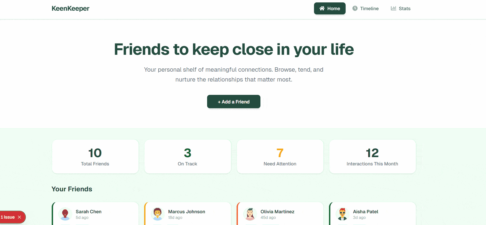

# KinKeeper — Friendship Tracking Web App

A friendship management dashboard built with Next.js where users can track their closest connections, log interactions, and visualize their social habits — all in a clean, responsive UI.

🔗 **Live Site:** [keenkeeper-nextjs-a7.vercel.app](https://keenkeeper-nextjs-a7.vercel.app/)
📁 **Repository:** [github.com/gitimtiaz/keenkeeper-nextjs-a7](https://github.com/gitimtiaz/keenkeeper-nextjs-a7)

---

## Features

- 👫 Browse 10 friends with status tracking (On-Track, Almost Due, Overdue)
- 📋 View detailed friend profiles with bio, tags, and contact preferences
- 📞 Log interactions — Call, Text, or Video — with one click
- 🔔 Toast notifications on every check-in action
- 📜 Timeline page showing all interactions with Call / Text / Video filter
- 📊 Friendship Analytics with a live Recharts Donut Pie Chart
- 💾 Persistent interaction history via localStorage
- 📱 Fully responsive across all screen sizes

---

## 🎥 Demo Overview

### 🖥️ UI & Responsive Design
A full walkthrough of the KeenKeeper interface, showcasing the responsive layout, modern UI, and clean design system built with Tailwind CSS and DaisyUI.



---

### ⚡ Core Functionality (Timeline + Interaction Logging)
Demonstrates the main functionality of the app — logging Call, Text, and Video interactions, triggering toast notifications, and dynamically updating the Timeline and Analytics.




## Tech Stack

| Tech | Purpose |
|---|---|
| Next.js 16 (App Router) | Framework + file-based routing |
| React 19 | Component-based UI |
| Tailwind CSS v4 | Utility-first styling |
| DaisyUI v5 | Tailwind component library |
| Recharts | Pie chart for analytics |
| react-hot-toast | Toast notifications |
| react-icons | Icon library |
| Geist Font | Typography |

---

## Getting Started

```bash
# Clone the repo
git clone https://github.com/gitimtiaz/KinKeeper.NextJS.A7.git

# Install dependencies
npm install

# Start the dev server
npm run dev
```

---

## Key Features

### 👫 Friends Dashboard
A responsive 4-column grid of friend cards, each showing avatar, last contact time, tags, and a color-coded status badge. Clicking any card navigates to a detailed profile page.

### 📞 Interaction Logging + Timeline
From any friend's profile, log a Call, Text, or Video check-in with a single click. Each interaction is saved to localStorage and instantly appears on the Timeline page, filterable by interaction type.

### 📊 Friendship Analytics
The Stats page pulls live data from the Timeline and renders a Recharts donut chart showing the distribution of Calls, Texts, and Videos — alongside summary count cards.

---

## Project Structure

```
src/
├── app/
│   ├── page.js               # Home — friends grid
│   ├── friends/[id]/         # Dynamic friend detail route
│   ├── timeline/             # Timeline page
│   └── stats/                # Analytics page
├── components/               # Reusable UI components
├── context/
│   └── TimelineContext.js    # Global state + localStorage
├── data/
│   └── friends.json          # Friend data source
└── lib/
    └── getFriends.js         # Data access helpers
```

---

## Highlights

- **Clean component structure** — every section is a separate, reusable component with logic kept out of the UI
- **Scalable data handling** — all friend data lives in `src/data/friends.json`, ready to be swapped with an API call
- **Smooth UX** — toast notifications, loading skeletons on every page, hover effects, and status-coded color system make interactions feel polished

---

© 2026 KinKeeper. Built by [Imtiaz](https://github.com/gitimtiaz)
